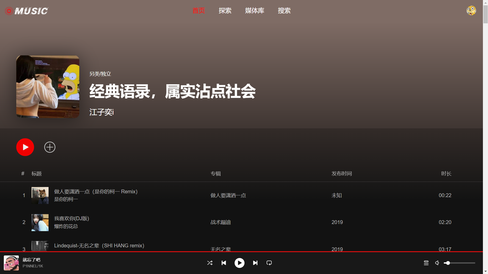
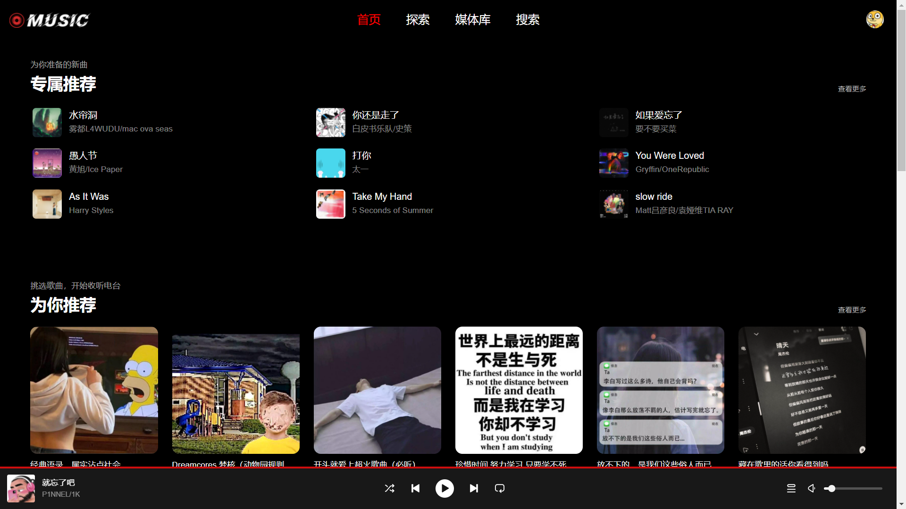
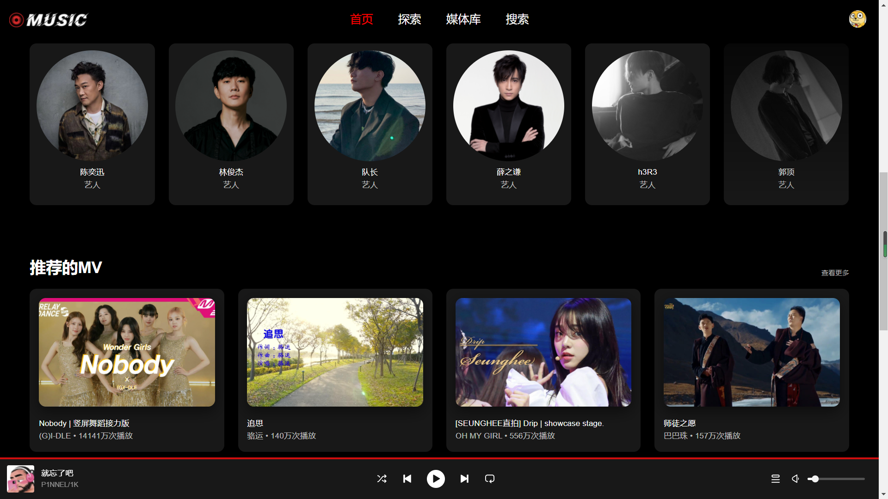
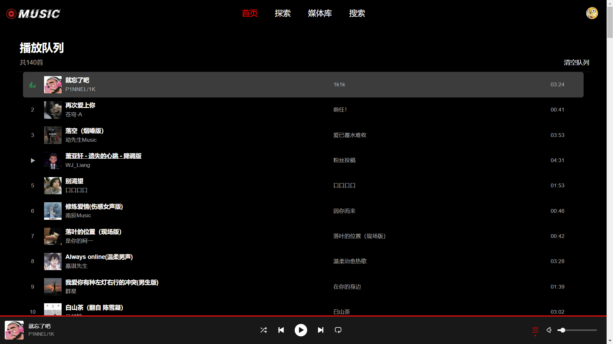

# 网易云音乐Web端

## 前言

API源自[网易云音乐 NodeJS 版 API](https://github.com/Binaryify/NeteaseCloudMusicApi)，非常感谢API提供者。

最近一项考试需要用到vue2所有没有选择3，本身也很少接触Audio API。发现如此全面的网易云音乐API后来踩踩坑，交互界面参考Spotify、YouTuBe Music，后续考虑用vue3、vite、typescript练手。

目前仍在开发，如果对您有帮助，您可以点右上角 "Star" 支持一下 谢谢！

## 演示

自动提取主题色

主页

主页

播放列表

## 技术栈
* vue2
* vue-cli
* less
* fetch

## 特点

* [x] 自动提取封面主题色
* [x] 全局图片懒加载
* [x] 显示缓存进度
* [x] 播放错误重连
* [x] 播放列表
* [x] 音乐播放器
* [x] 刷新恢复播放
* [x] 拖动调整进度
* [x] 显示播放进度
* [x] vip提示
* [ ] 登录
* [ ] 自动连播
* [ ] 选择码率
* [ ] 随机播放
* [ ] 播放模式
* [ ] 歌词

[我的博客](https://zusheng.club)
